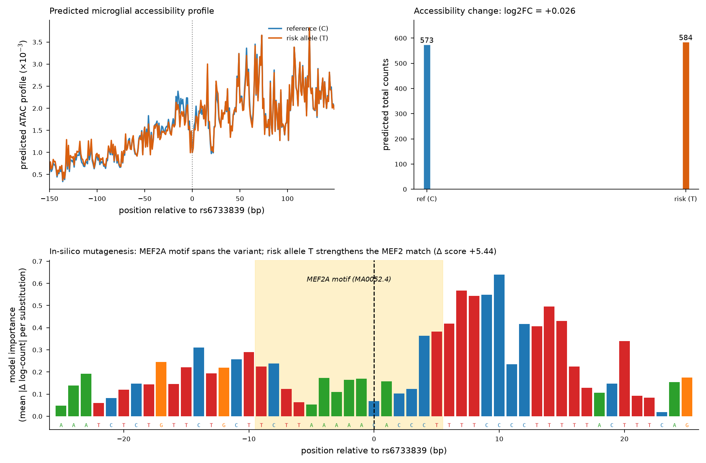

# regulatory-variant-agent

**Trace a noncoding disease variant to the transcription-factor motif it affects — directly from DNA sequence.**

Built with **Claude Science** for the *Built with Claude: Life Sciences* hackathon (Research track, Jul 2026).

Given a noncoding variant, this tool predicts its effect on chromatin accessibility from sequence (a pretrained **ChromBPNet** model), scans the effect across brain cell types, runs **in-silico mutagenesis + DeepSHAP-style attribution** to see *which bases the model weights*, and matches the region to **JASPAR** transcription-factor motifs — all from an rsID, in one command.

> **What this is:** a reusable, sequence-based variant-interpretation instrument. The Alzheimer's variant below is a worked example of it running on a real disease locus — with an honest, nuanced result, not a forced one.

## Quick start

```bash
pip install -r requirements.txt          # tensorflow 2.13, numpy<2, scipy, ...

# download the brain ChromBPNet models (Zenodo 10.5281/zenodo.10605867), then:
python score_variant.py --rsid rs6733839 \
    --model models/Microglia_chrombpnet_nobias.h5 \
    --outdir results/
```

Output: a JSON with the ref/alt accessibility change, ISM localization, and JASPAR motif scan. Point `--model` at any of the six cell-type models; pass `--motifs MA0052.4 MA0497.1 ...` for any JASPAR IDs. Works from `--rsid`, or `--chrom/--pos/--ref/--alt` for un-catalogued variants.

## Worked example: rs6733839 (BIN1 / Alzheimer's)

**`rs6733839`** — one of the strongest common Alzheimer's GWAS signals, ~28 kb upstream of **BIN1**.
- **Location:** chr2:127,135,234 (GRCh38), **C→T** (T = AD-risk allele, MAF ≈ 0.40)
- **Literature hypothesis:** the risk allele alters a **MEF2** binding site in a **microglia-specific enhancer**, changing BIN1 regulation.

### What the model actually found (honest result)

| Question | Result |
|---|---|
| Is the variant in a MEF2 motif? | **Yes** — MEF2A (`MA0052.4`) and MEF2C (`MA0497.1`) both span it (JASPAR scan). ✅ |
| Does the risk allele lower microglial accessibility? | **No** — predicted change is tiny and *positive* (log2FC **+0.026**). |
| Is the effect microglia-specific? | **No** — small and positive in microglia (+0.026, 3rd of 6 by signed effect); largest in inhibitory neurons (+0.229). |
| Does the model weight the variant base? | **No** — near-zero attribution at the variant; the model weights an adjacent C/T-rich (PU.1-like) element. Two attribution methods agree (r = 0.92). |

**Reading:** the MEF2 motif overlap is real and confirmed, but this scATAC-pseudobulk microglia model does **not** reproduce a strong, microglia-selective "risk allele breaks MEF2 → less accessibility" story. That is a legitimate, honestly-reported finding — real biology is messier than the one-line hypothesis, and the tool surfaces that rather than forcing a dramatic answer. See [`results/RESULTS.md`](results/RESULTS.md) for the full analysis and caveats.



## Pipeline

```
rsID / coords
   -> fetch GRCh38 window (2,114 bp, variant-centered)      [Ensembl + UCSC]
   -> ChromBPNet forward pass (ref & alt)                    -> log2FC of counts, profile JSD
   -> cell-type scan (6 brain models)                        -> is the effect cell-type-specific?
   -> in-silico mutagenesis + expected-gradients attribution -> which bases does the model weight?
   -> JASPAR motif scan (ref vs alt)                          -> which TF motif spans the variant?
```

## Status

- [x] Scoping + literature grounding + data/tool verification → [`SCOPING.md`](SCOPING.md)
- [x] Resolve cell-type model — **microglia ChromBPNet obtained** (Zenodo 10.5281/zenodo.10605867; confirmed the `Microglia_chrombpnet*.h5` files exist and load)
- [x] Score rs6733839 end-to-end (ref/alt Δ) → `results/`
- [x] Cell-type specificity scan (6 brain cell types)
- [x] ISM + DeepSHAP-style attribution + JASPAR motif match
- [x] One-command reusable tool → [`score_variant.py`](score_variant.py)
- [ ] Calibration against a null variant background (percentile scale) — next upgrade
- [ ] Demo video + write-up

## Data & models

- **Model:** brain-cell-type **ChromBPNet** models (base-resolution ATAC CNN, Tn5-bias-factorized), trained on **Corces scATAC pseudobulk** by the PsychENCODE/Weng group — Zenodo **10.5281/zenodo.10605867** (`Zenodo/data/chrombpnet/*_chrombpnet_nobias.h5`): Microglia, Astrocytes, Excitatory/Inhibitory neurons, Oligodendrocytes, OPCs. Underlying method: [ChromBPNet](https://github.com/kundajelab/chrombpnet).
- **Variant/coords:** Ensembl REST (GRCh38); **sequence:** UCSC hg38 API.
- **Motifs:** JASPAR CORE vertebrates (MEF2A `MA0052.4`, MEF2C `MA0497.1`).

See [`SCOPING.md`](SCOPING.md) for the full method lineage, verified accessions, and caveats; [`results/RESULTS.md`](results/RESULTS.md) for the analysis.

## License

MIT — see [`LICENSE`](LICENSE).
