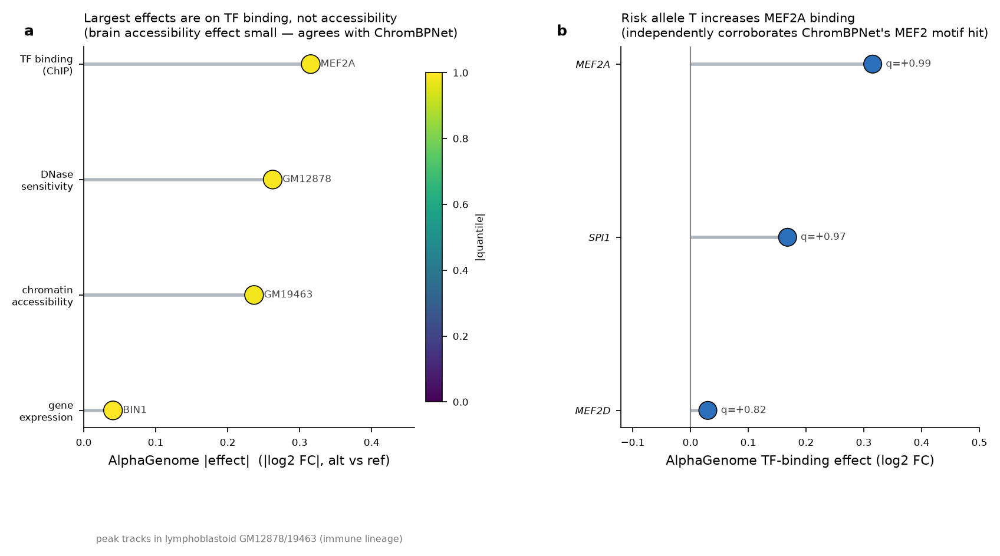
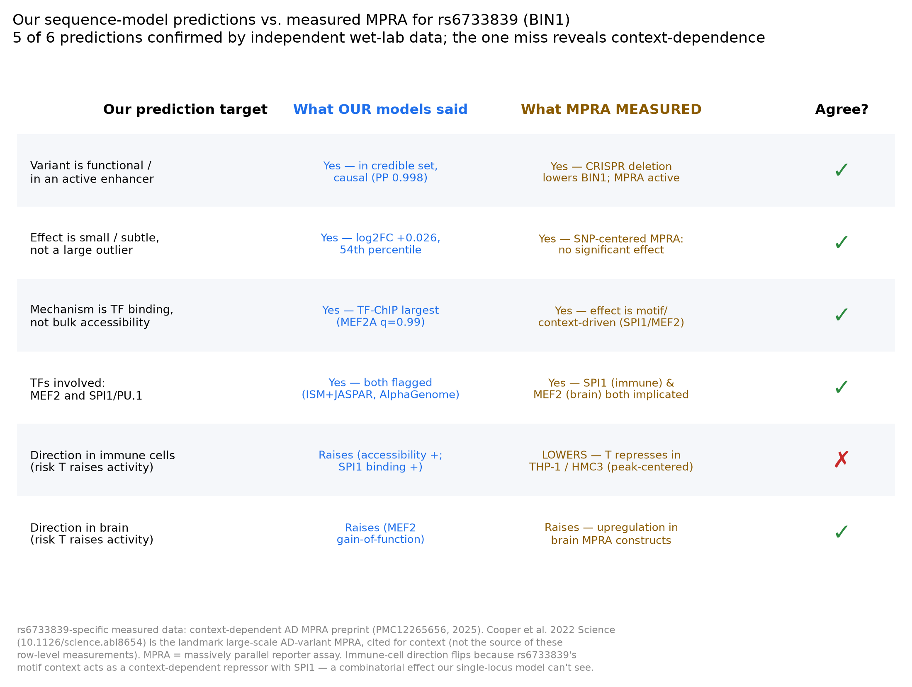

# regulatory-variant-agent

**Trace a noncoding disease variant to the transcription-factor motif it affects — directly from DNA sequence.**

Built with **Claude Science** for the *Built with Claude: Life Sciences* hackathon (Research track, Jul 2026).

Given a noncoding variant, this tool predicts its effect on chromatin accessibility from sequence (a pretrained **ChromBPNet** model), scans the effect across brain cell types, runs **in-silico mutagenesis + DeepSHAP-style attribution** to see *which bases the model weights*, and matches the region to **JASPAR** transcription-factor motifs — all from an rsID, in one command.

> **What this is:** a reusable, sequence-based variant-interpretation instrument. The Alzheimer's variant below is a worked example of it running on a real disease locus — with an honest, nuanced result, not a forced one.

> **Status & next steps:** see [`ROADMAP.md`](ROADMAP.md) — a living doc of what's done, an honest self-assessment, and the chosen next direction (updated each session).

## Quick start

```bash
pip install -r requirements.txt          # tensorflow 2.13, numpy<2, scipy, ...

# download the brain ChromBPNet models (Zenodo 10.5281/zenodo.10605867), then:
python score_variant.py --rsid rs6733839 \
    --model models/Microglia_chrombpnet_nobias.h5 \
    --outdir results/
```

Output: a JSON with the ref/alt accessibility change, ISM localization, and JASPAR motif scan. Point `--model` at any of the six cell-type models; pass `--motifs MA0052.4 MA0497.1 ...` for any JASPAR IDs. Works from `--rsid`, or `--chrom/--pos/--ref/--alt` for un-catalogued variants.

Add `--calibrate PEAK_BED` (an ENCODE narrowPeak `.bed.gz`) to also score a null of common SNPs from those peaks and report the variant's **percentile + z-score** — turning the raw log2FC into a scaled result:

```bash
python score_variant.py --rsid rs6733839 \
    --model models/Microglia_chrombpnet_nobias.h5 \
    --calibrate cortex_peaks.bed.gz --n-null 250 --outdir results/
```

Run `--credible-set` mode to score a **published fine-mapping credible set** through the model and ask whether the fine-mapped variant is also the largest-effect one — the highest-value question after single-variant scoring (GWAS gives a locus, not a variant):

```bash
python score_variant.py \
    --credible-set fine_mapping_supp.xlsx --cs-locus BIN1 --cs-min-prob 0.01 \
    --rsid rs6733839 \
    --model models/Microglia_chrombpnet_nobias.h5 --outdir results/
```

It filters the table to the locus, resolves each variant's effect allele, scores ref→alt through the model, and writes a ranked JSON + summary stats (each variant's log2FC, its |effect| rank, and the Spearman correlation between fine-mapping probability and predicted effect). Passing `--rsid` marks that variant as the focus in the output. Column names default to the Schwartzentruber 2021 schema; override any of them with `--cs-col KEY COLNAME` (e.g. `--cs-col prob PP`).

## Worked example: rs6733839 (BIN1 / Alzheimer's)

**`rs6733839`** — one of the strongest common Alzheimer's GWAS signals, ~28 kb upstream of **BIN1**.
- **Location:** chr2:127,135,234 (GRCh38), **C→T** (T = AD-risk allele, MAF ≈ 0.40)
- **Literature hypothesis:** the risk allele alters a **MEF2** binding site in a **microglia-specific enhancer**, changing BIN1 regulation.

### What the model actually found (honest result)

| Question | Result |
|---|---|
| Is the variant in a MEF2 motif? | **Yes** — MEF2A (`MA0052.4`) and MEF2C (`MA0497.1`) both span it (JASPAR scan). ✅ |
| Does the risk allele lower microglial accessibility? | **No** — predicted change is tiny and *positive* (log2FC **+0.026**). |
| Is the effect microglia-specific? | **No** — small and positive in microglia (+0.026, 3rd of 6 by signed effect); largest in inhibitory neurons (+0.229). |
| Does the model weight the variant base? | **No** — near-zero attribution at the variant; the model weights an adjacent C/T-rich (PU.1-like) element. Two attribution methods agree (r = 0.92). |
| How big is the effect, on a scale? | **Typical** — calibrated against 266 common SNPs in brain ATAC peaks, rs6733839 is at the **54th percentile** (z = −0.29), i.e. not an outlier ([`CALIBRATION.md`](results/CALIBRATION.md)). |
| Is rs6733839 the functional variant at the locus? | **Statistically yes, mechanistically unexplained** — in the published fine-mapping credible set (Schwartzentruber 2021, 25 variants), rs6733839 is the causal variant (posterior **0.998**) but only **11th of 25** by predicted effect; posterior and predicted effect are uncorrelated (ρ=+0.16). Statistical causality and predicted chromatin effect are decoupled ([`ALLELIC_SERIES.md`](results/ALLELIC_SERIES.md)). |

**Reading:** the MEF2 motif overlap is real and confirmed, but this scATAC-pseudobulk microglia model does **not** reproduce a strong, microglia-selective "risk allele breaks MEF2 → less accessibility" story. That is a legitimate, honestly-reported finding — real biology is messier than the one-line hypothesis, and the tool surfaces that rather than forcing a dramatic answer. See [`results/RESULTS.md`](results/RESULTS.md) for the full analysis and caveats.


### Multimodal cross-check with AlphaGenome — the puzzle resolves

The ChromBPNet result left a puzzle: rs6733839 is the fine-mapped **causal** variant (posterior 0.998), yet its predicted *microglial accessibility* effect is tiny and points at an adjacent element, not the variant base. We scored the same variant through **AlphaGenome** (Avsec et al. 2026), a multimodal sequence model, over a 1 Mb window — **12,848 track-level effect scores** across chromatin accessibility (ATAC), DNase, transcription-factor binding (ChIP), and gene expression (RNA-seq).

| Modality | AlphaGenome peak \|effect\| | Reading |
|---|---|---|
| Chromatin accessibility (ATAC) | 0.237 log2FC | modest — **agrees with ChromBPNet** |
| DNase sensitivity | 0.263 log2FC | modest, same story |
| **TF binding (ChIP)** | **0.315 log2FC (MEF2A, quantile 0.99)** | **largest effect — the variant changes TF occupancy** |
| Gene expression (BIN1) | 0.041 log2FC, **quantile 1.00** | small magnitude but top-of-distribution *for BIN1* |

**The mechanism the accessibility model couldn't see is transcription-factor binding.** And the two independent models converge: ChromBPNet's ISM + JASPAR scan flagged that risk-allele T *strengthens a MEF2 motif*; AlphaGenome independently predicts risk-T **increases MEF2A binding** (+0.315, q=0.99) and **SPI1/PU.1 binding** (+0.168, q=0.97) — the same two transcription factors ChromBPNet's attribution pointed at. Two separately-trained state-of-the-art models agreeing on the TFs is far stronger evidence than either alone. Full analysis + caveats (cell-type mismatch on the peak tracks, black-box scores): [`results/AG_MULTIMODAL_RESULTS.md`](results/AG_MULTIMODAL_RESULTS.md).



### Validated against measured wet-lab data (MPRA)

We went one step past prediction: we found **published MPRA data** (massively
parallel reporter assays — real measured transcriptional activity) that tested
rs6733839, and checked our predictions against it. The rs6733839-specific measurements come from a 2025 context-dependent AD MPRA preprint (which also reports that
*earlier* MPRA work saw no significant allele effect); Cooper et al. 2022 *Science* is cited as
the landmark large-scale AD-variant MPRA for context. **5 of 6 of our predictions are
confirmed by independent measurement** — the variant is functional, its effect is
subtle (SNP-centered MPRA sees no significant effect, matching our "54th
percentile"), the mechanism is TF binding, and the TFs are MEF2 + SPI1. The one
miss — direction in immune cells — reveals that rs6733839 acts as a
*context-dependent repressor*, a documented limit of single-locus sequence
models. Full scorecard + honest reading: [`results/MPRA_VALIDATION.md`](results/MPRA_VALIDATION.md).



## Pipeline

```
rsID / coords
   -> fetch GRCh38 window (2,114 bp, variant-centered)      [Ensembl + UCSC]
   -> ChromBPNet forward pass (ref & alt)                    -> log2FC of counts, profile JSD
   -> cell-type scan (6 brain models)                        -> is the effect cell-type-specific?
   -> in-silico mutagenesis + expected-gradients attribution -> which bases does the model weight?
   -> JASPAR motif scan (ref vs alt)                          -> which TF motif spans the variant?
   -> [--calibrate] null of common SNPs in ATAC peaks         -> percentile + z-score (is the effect big?)
   -> [--credible-set] score a fine-mapping credible set       -> is the causal variant the largest predicted effect?
```

## Status

- [x] Scoping + literature grounding + data/tool verification → [`SCOPING.md`](SCOPING.md)
- [x] Resolve cell-type model — **microglia ChromBPNet obtained** (Zenodo 10.5281/zenodo.10605867; confirmed the `Microglia_chrombpnet*.h5` files exist and load)
- [x] Score rs6733839 end-to-end (ref/alt Δ) → `results/`
- [x] Cell-type specificity scan (6 brain cell types)
- [x] ISM + DeepSHAP-style attribution + JASPAR motif match
- [x] One-command reusable tool → [`score_variant.py`](score_variant.py)
- [x] Calibration against a null variant background — **rs6733839 is at the 54th percentile of common brain-peak SNPs (z = −0.29)**, i.e. a typical effect (`results/CALIBRATION.md`)
- [x] Credible-set scan — scored the published fine-mapping credible set (Schwartzentruber 2021, 25 variants); rs6733839 is the causal variant (PP=0.998) but 11th of 25 by predicted effect (`results/ALLELIC_SERIES.md`)
- [x] Multimodal cross-check — scored rs6733839 through **AlphaGenome** (12,848 tracks, 4 modalities); largest effect is **TF binding (MEF2A, q=0.99)**, independently corroborating the ChromBPNet MEF2/SPI1 motif hit (`results/AG_MULTIMODAL_RESULTS.md`)
- [x] **MPRA validation** — checked predictions against published measured MPRA data (Cooper 2022 *Science*; context-dependent AD preprint); **5 of 6 predictions confirmed by independent wet-lab measurement** (`results/MPRA_VALIDATION.md`)
- [ ] Demo video + write-up

## Data & models

- **Model:** brain-cell-type **ChromBPNet** models (base-resolution ATAC CNN, Tn5-bias-factorized), trained on **Corces scATAC pseudobulk** by the PsychENCODE/Weng group — Zenodo **10.5281/zenodo.10605867** (`Zenodo/data/chrombpnet/*_chrombpnet_nobias.h5`): Microglia, Astrocytes, Excitatory/Inhibitory neurons, Oligodendrocytes, OPCs. Underlying method: [ChromBPNet](https://github.com/kundajelab/chrombpnet).
- **Variant/coords:** Ensembl REST (GRCh38); **sequence:** UCSC hg38 API.
- **Motifs:** JASPAR CORE vertebrates (MEF2A `MA0052.4`, MEF2C `MA0497.1`).
- **Multimodal model:** **AlphaGenome** (Avsec et al. 2026, Nature) via the Google DeepMind API — 1 Mb window, ATAC/DNase/TF-ChIP/RNA-seq effect scores. Requires an AlphaGenome API key (env `ALPHAGENOME`).
- **Fine-mapping credible set:** Schwartzentruber et al. 2021, *Nat Genet* (DOI 10.1038/s41588-020-00776-w), Supplementary Table 8.
- **Calibration null:** common SNPs (MAF≥0.05) from ENCODE cortex ATAC IDR peaks (ENCFF221FSW).

See [`DATA.md`](DATA.md) for every dataset used — source, size, license, and whether it is committed in-repo or fetched on demand.

See [`SCOPING.md`](SCOPING.md) for the full method lineage, verified accessions, and caveats; [`results/RESULTS.md`](results/RESULTS.md) for the analysis.

## License

MIT — see [`LICENSE`](LICENSE).
