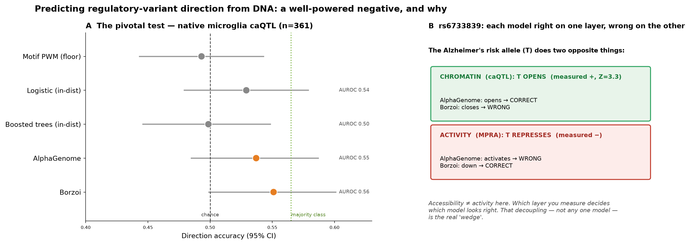
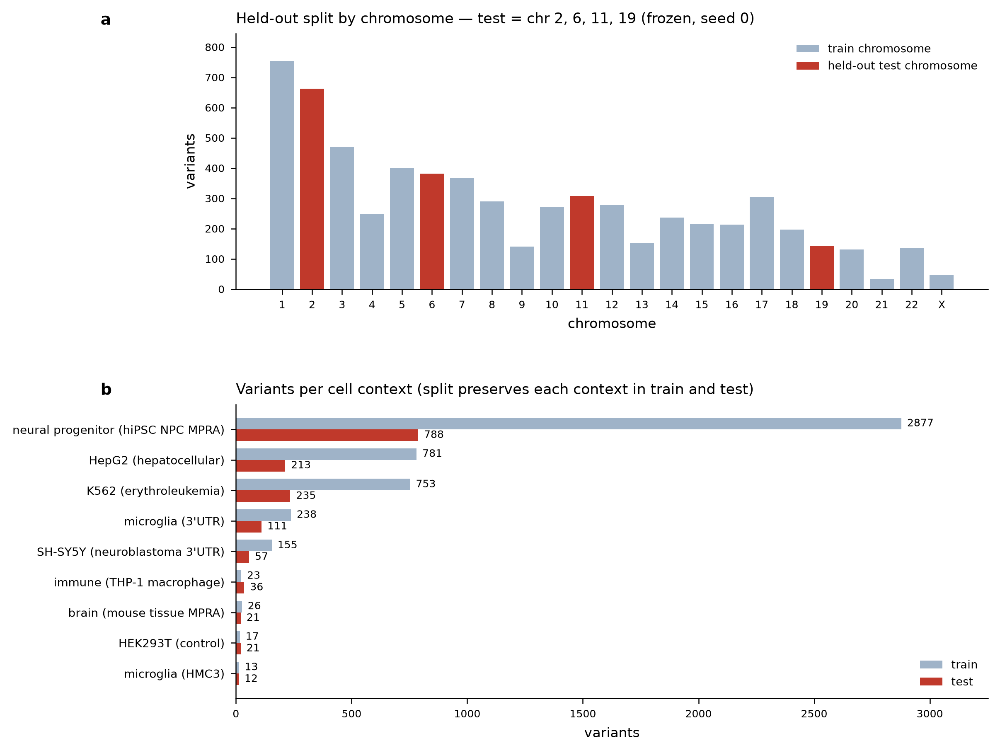
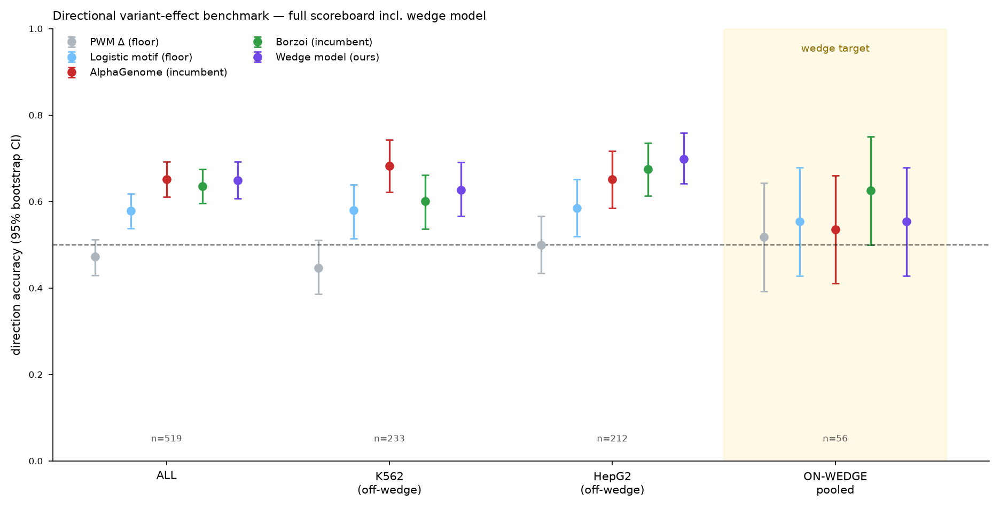
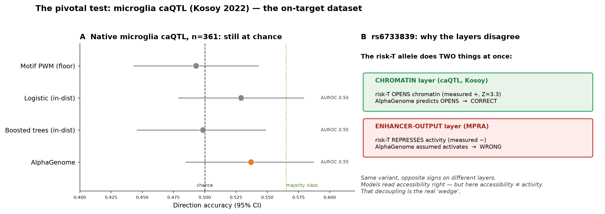
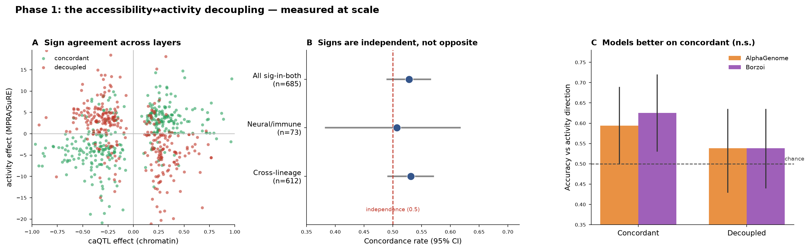
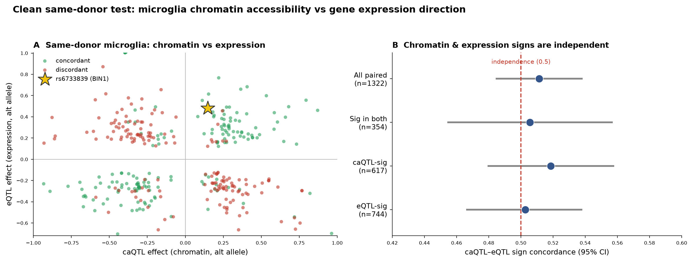
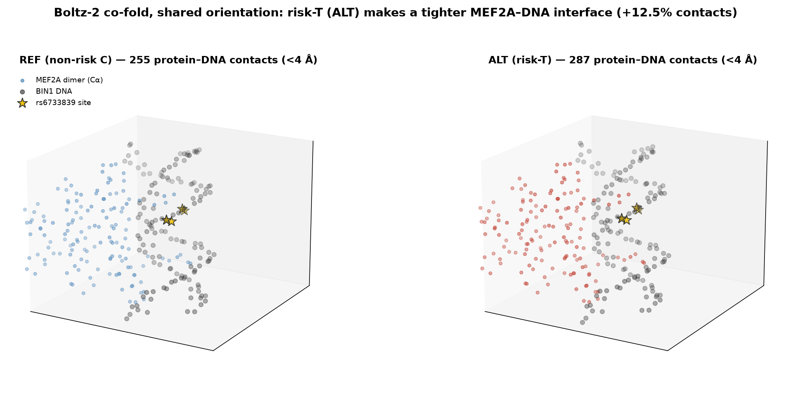

# regulatory-direction-independence

**Can sequence-to-function models predict the _direction_ of a noncoding variant's regulatory effect? A benchmark, a well-powered negative result, and the mechanism behind it — in human microglia.**

Built with **Claude Science** for the *Built with Claude: Life Sciences* hackathon (Research track, Jul 2026).

[](https://doi.org/10.5281/zenodo.21332017)

📄 **Preprint (Zenodo, CC-BY 4.0):** https://doi.org/10.5281/zenodo.21332017 · local copy [`MANUSCRIPT_bioRxiv.pdf`](MANUSCRIPT_bioRxiv.pdf) · [`MANUSCRIPT_bioRxiv.md`](MANUSCRIPT_bioRxiv.md)  
📈 **Provenance:** [`ROADMAP.md`](ROADMAP.md) — every stage with config, seed, and split manifest

---

## TL;DR

Deep-learning models that read DNA (Borzoi, AlphaGenome, and the DeepSEA/Basset lineage) predict genomic assay *tracks* very well. But the question a disease-variant pipeline actually needs — **does this variant push accessibility / expression UP or DOWN in the relevant cell type?** — they answer at chance. We show this on a fair, chromosome-split benchmark in the microglia/brain/immune context, and then we show **why**: in the same donors, a variant's effect on chromatin accessibility and its effect on gene expression are **statistically independent**. A model that reads one layer cannot recover the direction of a layer it does not read.

> **The whole study in one figure:**



*Left: on the pivotal native-microglia caQTL test, every model sits at chance. Right: the Alzheimer's risk allele of rs6733839 does two opposite things depending on which layer you measure — so each model looks "right" on one layer and "wrong" on the other. The decoupling, not any single model, is the finding.*

---

## The research arc, start to finish

The project ran as four staged phases. Each figure below is the deliverable of one phase, in order.

### Phase 0 — Build a fair benchmark

Before touching a model, we assembled a held-out test set of noncoding variants with **laboratory-measured effect direction**, spanning nine cell contexts (6,377 variant×context measurements), and split it by **whole chromosome** (never by variant) so linkage disequilibrium cannot leak between train and test.



*(a) Variants per chromosome; the four held-out test chromosomes (2, 6, 11, 19; seed 0) in red — chr2 is forced to test to retain BIN1/rs6733839. (b) The chromosome-level split still preserves all nine cell contexts in both train and test.*

### Phase 1 — Score every model on the identical set

We scored both frontier incumbents (**AlphaGenome** via API, **Borzoi** open weights), two floor baselines (a JASPAR motif-PWM Δ-score and a logistic-regression on motif features), and a purpose-built directional model (the **"wedge" model** — a gradient-boosted model on motif + Borzoi-embedding + grammar features, trained to target exactly the directional question). All scored on the same held-out set, with 95% bootstrap CIs.



*Direction accuracy with 95% bootstrap CIs across contexts. Off-wedge (K562, HepG2), every model clears chance — sequence carries directional signal for episomal reporter activity. But in the microglia/brain/immune target ("on-wedge, pooled"), **every model — incumbents, floors, and ours — collapses to chance.** The directional model is a characterized negative: it does not beat the incumbents where it matters, and we report that honestly.*

Zooming into the single fairest test — chromatin-accessibility direction in the **native** cell type (the 95-donor Kosoy microglia caQTL map), the intended task in the intended context:



*(A) AlphaGenome (0.537), Borzoi (0.551), floors, and in-distribution controls all fall at or below the majority-class baseline (0.565). Not a model-capacity problem — training directly on the caQTL data lands at chance too. (B) rs6733839 makes it concrete: the risk-T allele opens chromatin but represses episomal activity, so each model is "right" on one layer and "wrong" on the other.*

### Phase 2 — Explain the failure: the layers decouple

If the direction isn't recoverable, why? We tested whether a variant's effect on one regulatory layer predicts its effect on another.



*(A) Accessibility (caQTL) vs activity (MPRA/SuRE) effect signs scatter with no diagonal structure. (B) Sign concordance sits at the independence line (0.5) in every stratum. (C) Models are marginally better on concordant than decoupled variants, but not significantly — the decoupling is what limits them.*

The clean, confound-free version — the definitive number — comes from the **same 95 microglia donors**, comparing chromatin-accessibility QTLs against expression QTLs:



*(A) Per-variant caQTL effect vs eQTL effect in the same donors; rs6733839 (BIN1) starred. (B) Sign concordance is indistinguishable from independence at every significance stratum — 0.506 (95% CI 0.455–0.556, p = 0.87) for the 354 variants significant in both layers. **Chromatin accessibility and gene expression effect-directions are statistically independent.***

### Phase 3 — Anchor the mechanism structurally

Finally, we grounded the story on the lead variant. rs6733839 **opens** chromatin (caQTL +, Z 3.3) and **raises** BIN1 expression (eQTL +, Z 6.4) in microglia — the native-genome layers agree — while **repressing** an isolated enhancer in a reporter. A Boltz-2 protein–DNA co-fold explains the direction:



*Both alleles co-folded with the MEF2A dimer in a shared orientation (both high-confidence, interface pTM 0.978). The risk-T allele forms a **tighter** protein–DNA interface — 287 vs 255 contacts within 4 Å (+12.5%) — consistent with the risk allele strengthening a MEF2 binding site.*

---

## Why this matters

For anyone using sequence models to interpret variants: **do not trust a single-layer model's direction call on the variants that matter most for disease.** These models are excellent at what they were trained for (track prediction) and unreliable at the directional question they are increasingly asked to answer. This repo provides an open, chromosome-split benchmark and every per-variant score, so the field has a like-for-like way to measure directional accuracy — and a mechanistic reason the ceiling exists.

---

## Repository layout

```
bench/         harmonized benchmark: variants with measured direction, split manifest, per-model scores
results/       main-text + summary figures, result tables
  decoupling/  Phase 1-3 decoupling analysis, same-donor caQTL∩eQTL, Boltz co-fold, structures
docs/          publication plan, hackathon summary, demo video guide
MANUSCRIPT_bioRxiv.md / .pdf    the preprint (10 pages, 4 main + 1 supplementary figure)
ROADMAP.md     living provenance log (per-stage config, seed, split)
score_variant.py                sequence-based variant-scoring tool (see below)
```

Everything is committed per analysis stage with configuration and random seed. Genome build GRCh38 throughout.

### Benchmark data sources

| Source | Layer / context | Access |
|---|---|---|
| Kosoy et al. 2022 caQTL + meta-eQTL (95 microglia donors) | chromatin accessibility, expression | AD Knowledge Portal / Synapse (registered — account + data-use terms, no sponsor) |
| SuRE raQTL (K562, HepG2) | episomal activity | open (OSF) |
| 2025 context-dependent AD-MPRA | THP-1, HMC3, brain, HEK293T | open |
| GSE244011, GSE253841 | NPC MPRA, 3′-UTR MPRA | open (GEO) |

Variant scoring used the AlphaGenome API (non-commercial terms) and Borzoi open weights (replicate 0). Structure prediction used Boltz-2.

---

## The `score_variant.py` tool

The repo also contains the sequence-based variant-interpretation tool built in the project's first phase: given an rsID, it predicts a variant's chromatin-accessibility effect from a pretrained **ChromBPNet** model, runs in-silico mutagenesis + attribution to localize which bases the model weights, and matches the region to **JASPAR** motifs.

```bash
pip install -r requirements.txt
# download the brain ChromBPNet models (Zenodo 10.5281/zenodo.10605867), then:
python score_variant.py --rsid rs6733839 \
    --model models/Microglia_chrombpnet_nobias.h5 --outdir results/
```

Supports `--calibrate PEAK_BED` (percentile + z-score against a common-SNP null) and `--credible-set TABLE.xlsx` (score a published fine-mapping credible set and test whether the fine-mapped variant is also the largest-effect one). This tool is a *component* of the project — the benchmark and the decoupling finding above are the contribution.

---

## Citation

If you use this benchmark or the analysis, please cite the preprint (see [`MANUSCRIPT_bioRxiv.md`](MANUSCRIPT_bioRxiv.md) for the full reference list and author details).

Built with Claude Science; all study design, methodological decisions, and claims are the author's, who takes full responsibility for the content.


---

## Cite this work

If you use this benchmark, the paired-layer independence statistic, or the per-variant scores, please cite the Zenodo record:

> Singh, A. D. (2026). *Effect-direction of noncoding regulatory variants is not predictable from sequence because chromatin accessibility and gene expression decouple: a benchmark and mechanistic analysis in human microglia.* Zenodo. https://doi.org/10.5281/zenodo.21332017

**BibTeX**
```bibtex
@misc{singh2026direction,
  author       = {Singh, Anuj Dev},
  title        = {Effect-direction of noncoding regulatory variants is not predictable
                  from sequence because chromatin accessibility and gene expression
                  decouple: a benchmark and mechanistic analysis in human microglia},
  year         = {2026},
  publisher    = {Zenodo},
  doi          = {10.5281/zenodo.21332017},
  url          = {https://doi.org/10.5281/zenodo.21332017}
}
```

- **Concept DOI** (always latest version): [10.5281/zenodo.21332017](https://doi.org/10.5281/zenodo.21332017)
- **This version**: [10.5281/zenodo.21332018](https://doi.org/10.5281/zenodo.21332018)
