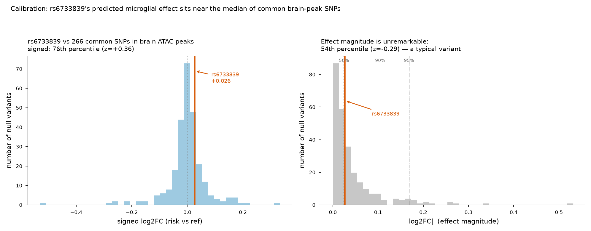

# Calibration & robustness — rs6733839 (microglia ChromBPNet)

*Turns the raw effect score into a scaled, interpretable result. All numbers computed this session.*

## The question this answers
The variant's predicted effect was **log2FC = +0.026** — but on its own that number has no scale. Is +0.026 big or small? Calibration answers it by scoring a **null set of real common SNPs drawn from real brain ATAC-seq peaks** through the same model, then locating rs6733839 in that distribution.

## Null set
- **266 common SNPs** (MAF ≥ 0.05), each a real dbSNP variant sitting inside an **ENCODE brain ATAC-seq IDR peak** (cortex, `ENCFF221FSW`, GRCh38).
- Sampled genome-wide across the peak set, biallelic SNVs only, ref base confirmed against hg38 before scoring.
- Each scored ref vs alt through the **microglia ChromBPNet** model (identical pipeline to the variant).
- *Caveat:* these are **bulk-brain** peaks, not microglia-specific — a "common variant in accessible brain chromatin" null, which is the honest interpretation.

## Result — rs6733839 is a typical variant, not an outlier

| Metric | Value | Reading |
|---|---|---|
| Null |log2FC|: mean ± sd | 0.044 ± 0.061 | typical effect size in the null |
| Null 90th / 95th percentile |log2FC| | 0.105 / 0.168 | where "notable" variants start |
| **rs6733839 |log2FC|** | **0.026** | below the null mean |
| **Percentile (|effect|, vs 266 common)** | **54th** | right at the median |
| **z-score (|effect|)** | **-0.29** | slightly below average |
| Percentile vs 54 MAF-matched (0.30-0.50) SNPs | 57th | same story |
| Percentile (signed, direction-aware) | 76th | mildly positive vs a null centered at ~0 |

**rs6733839's predicted microglial effect sits essentially at the median of common brain-peak SNPs.** It is not an accessibility outlier in this model — a rigorous, quantified version of "the effect is small."

## Robustness (no folds available, so a bias-model cross-check instead)
The Zenodo deposit ships **one model per cell type** (`_chrombpnet.h5` = with-bias, `_chrombpnet_nobias.h5` = bias-corrected), **not** multiple training folds — so fold-averaging isn't possible. Instead, scoring rs6733839 through both:

| Model | log2FC |
|---|---|
| bias-corrected (nobias, used throughout) | +0.0264 |
| with-bias (full) | +0.0251 |

The two agree closely in direction and magnitude — the small positive effect is stable to bias handling, not an artifact of the correction step.

## What this adds to the story
The tool now reports **not just a number but a percentile** — "this variant's effect is at the 54th percentile of common brain-peak SNPs (z = -0.29)." That is the difference between an uncalibrated reading and a measured one, and it lets the honest conclusion be stated quantitatively: *rs6733839 sits in a MEF2 motif, but this microglia model predicts an accessibility effect no larger than a typical common variant in open brain chromatin.*

## Files
- `fig4_calibration.png` — null distributions (signed + |effect|) with rs6733839 marked.
- `calibration.json`, `robustness.json` — machine-readable outputs.
- `--calibrate PEAK_BED` flag added to `score_variant.py` to reproduce for any variant.
