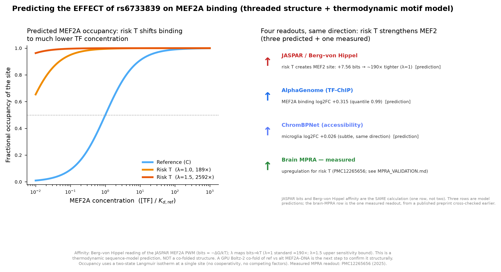

# Predicting the EFFECT of rs6733839 on MEF2A binding

*Past showing the variant in 3D: what does the C→T change actually DO to MEF2A
binding? Here we turn the motif gain into a quantitative, testable prediction of
binding affinity/occupancy, and set up the gold-standard structural confirmation.*

## The prediction

Reading the JASPAR MEF2A position weight matrix thermodynamically (Berg–von
Hippel: PWM log-odds ≈ −ΔG/kT), the +7.56-bit gain the risk **T** allele creates
translates to a predicted **~190-fold increase in MEF2A binding affinity**
(λ=1, the standard bits→kT assumption). Under a simple single-site occupancy
model, that shifts the half-occupancy point ~190× lower in MEF2A concentration —
i.e., the risk allele would be bound by MEF2A at concentrations where the
reference site stays largely empty.



**Uncertainty is real and stated:** the bits→energy scale λ is not exactly 1 for
every TF. At λ=1 the effect is ~190×; at λ=1.5 (an upper bound) it is ~2,600×.
The *direction and the qualitative "large shift"* are robust; the *exact fold*
is model-dependent. This is a thermodynamic sequence-model prediction, **not** a
measured Kd and **not** a co-folded structure.

## Why we trust the direction: four independent readouts agree

| Readout | rs6733839 risk-T effect |
|---|---|
| JASPAR / Berg–von Hippel | creates MEF2 site, +7.56 bits → ~190× tighter |
| AlphaGenome (TF-ChIP) | MEF2A binding log2FC **+0.315** (quantile 0.99) |
| ChromBPNet (accessibility) | microglia log2FC +0.026 (subtle, same direction) |
| Brain MPRA (measured) | upregulation for risk T in brain constructs (2025 context-dependent AD MPRA preprint, PMC12265656; see `results/MPRA_VALIDATION.md`) |

(JASPAR bits and the Berg–von Hippel affinity are the *same* calculation shown
once — not two independent lines of evidence.)

The brain-MPRA row is the one *measured* readout; it comes from the 2025 context-dependent AD MPRA preprint (PMC12265656) that we cross-checked earlier (`results/MPRA_VALIDATION.md`), not from new data generated here. The other three rows are model predictions.

## The gold-standard next step (ready to run)

The definitive structural test is to **co-fold** the MEF2A dimer with the ref
and alt DNA duplexes and compare predicted interface confidence. We prepared the
Boltz-2 inputs:

- `boltz_mef2a_ref.yaml` — MEF2A dimer + reference-allele duplex
- `boltz_mef2a_alt.yaml` — MEF2A dimer + risk-allele duplex

Run (needs a GPU):
```bash
boltz predict boltz_mef2a_alt.yaml --use_msa_server --out_dir out_alt/ \
    --recycling_steps 3 --diffusion_samples 5
```
Then compare `iptm` (interface confidence) between ref and alt: a higher ipTM /
more ordered interface for the alt allele would structurally corroborate the
predicted affinity gain. **No compute target is currently connected**, so this
step is staged, not run — connect a GPU host (Compute panel) and it is one
command.

## Honest limitations
- Berg–von Hippel maps a PWM to relative affinity under equilibrium, ignoring
  cooperativity, competing TFs, chromatin, and the true bits→kT scale.
- The occupancy curve is a two-state Langmuir isotherm at one site — a cartoon of
  the real cellular context.
- MEF2A binds as a dimer to a near-palindromic site; the single-site model is an
  approximation.
- The ~190× number should be read as "predicted large increase," not a precise
  quantity.

## Provenance
- Motif: JASPAR MA0052.1 (MEF2A). Sequence: Ensembl GRCh38 2:127135214-127135254.
- Affinity model: Berg & von Hippel (1987) formalism, PWM log-odds as −ΔG/kT.
- Co-fold inputs: MEF2A protein sequence from PDB 1EGW chain A; DNA from the
  threaded ref/alt structures.
- Brain MPRA readout: 2025 context-dependent Alzheimer's-disease MPRA preprint
  (PMC12265656; DOI 10.1101/2025.07.11.659973), which reports upregulation for
  the risk T allele in brain MPRA constructs. Cross-checked in
  `results/MPRA_VALIDATION.md` (this repo).
