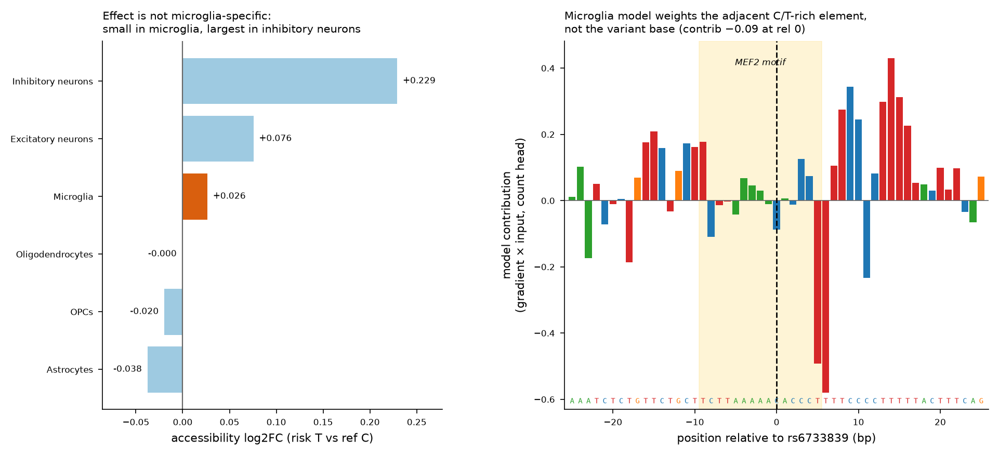
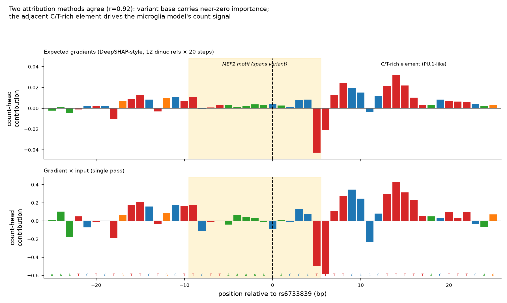

# Results — rs6733839 (BIN1 / Alzheimer's), microglia ChromBPNet

*Every number here was computed with `score_variant.py` on the microglia ChromBPNet model (Zenodo 10.5281/zenodo.10605867). Reproduce with the command in the README.*

## 1. Variant effect prediction (microglia)

| | ref (C) | risk (T) | Δ |
|---|---|---|---|
| Predicted total counts | 573.4 | 584.0 | **log2FC +0.026** |
| Profile shape (JSD) | — | — | 0.017 |

The risk allele *slightly increases* predicted microglial accessibility — the **opposite direction** of the naive "risk lowers accessibility" hypothesis, and very small in magnitude.

## 2. Cell-type specificity (6 brain models)

| Cell type | log2FC (risk T vs ref C) |
|---|---|
| Inhibitory neurons | **+0.229** |
| Excitatory neurons | +0.076 |
| **Microglia** | **+0.026** |
| Oligodendrocytes | −0.000 |
| OPCs | −0.020 |
| Astrocytes | −0.038 |

The effect is **not microglia-specific** — microglia's log2FC (+0.026) is 3rd-highest of the six by signed value, and the largest predicted effect is in inhibitory neurons. All effects are small (|log2FC| < 0.25), so this is near-noise ranking; but to the extent there is signal, it is not microglia-selective in this model.

## 3. In-silico mutagenesis + attribution

- **ISM** (±25 bp): the model's importance peaks at **+10 bp** (a C/T-rich stretch), not at the variant. Variant-base importance = 0.068 (low).
- **DeepSHAP-style attribution** (expected gradients, 12 dinucleotide-shuffled refs × 20 steps): **variant base contributes +0.004 (near zero)**; the adjacent C/T-rich element at +5…+15 bp dominates (peak 0.043). Gradient×input agrees at **r = 0.92**.

## 4. JASPAR motif scan (ref vs alt, overlapping the variant)

| Motif | Overlaps variant? | ref score | alt score | Δ |
|---|---|---|---|---|
| MEF2A — MA0052.4 | **yes** | 5.51 | 10.95 | **+5.44** |
| MEF2C — MA0497.1 | **yes** | 5.21 | 10.27 | **+5.06** |
| SPI1/PU.1 — MA0080.6 | no (best hit on the adjacent C/T-rich stretch) | 3.34 | 3.85 | +0.51 |

The MEF2 motif genuinely spans the variant, and — by PWM log-odds — the risk allele T *strengthens* the MEF2 match (Δ positive), consistent with the small positive accessibility change.

## Interpretation (honest)

1. **The motif-level hypothesis holds:** rs6733839 sits inside a MEF2A/MEF2C site. ✅
2. **The accessibility story does not, in this model:** the predicted effect is tiny, *positive*, and not microglia-specific; the model weights an adjacent C/T-rich (PU.1-like) element more than the variant base.
3. This is a legitimate, honestly-reported result — the tool surfaces a nuanced picture rather than forcing the textbook answer.

## Caveats

- Single **scATAC-pseudobulk** microglia model; the effect may be on TF *occupancy* or on **BIN1 promoter looping** (a mechanism an accessibility model can't see) rather than on bulk accessibility.
- Attribution used **expected gradients** (DeepSHAP-equivalent), not the exact DeepLIFT rescale rule of ChromBPNet's packaged `modisco` workflow; scored on the **nobias** count head only.
- Attribution scored on the **nobias** count head only; the with-bias model was used as a robustness cross-check (agrees: +0.025 vs +0.026).

## Calibration (added)

The raw log2FC +0.026 was calibrated against **266 real common SNPs sampled from ENCODE brain ATAC-seq peaks**, scored through the same microglia model. rs6733839 lands at the **54th percentile by effect magnitude (z = −0.29)** — right at the median, *not* an outlier. Full detail and figure: [`CALIBRATION.md`](CALIBRATION.md).

## Files

- `fig1_variant_prediction.png` — profile ref vs alt, count change, ISM track.
- `fig2_celltype_and_attribution.png` — cell-type log2FC + gradient×input attribution.
- `fig3_deepshap_attribution.png` — expected-gradients vs gradient×input, two methods agree.
- `scores_microglia.json`, `scores_by_celltype.json` — machine-readable outputs.
