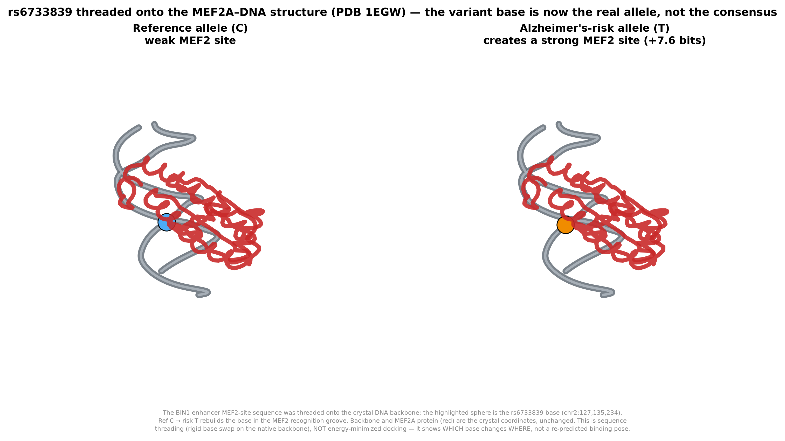

# Threading the real rs6733839 variant onto the MEF2A–DNA structure

*The honest next step past the illustrative structures: instead of showing MEF2A
on its consensus site, we put the **actual BIN1 enhancer sequence** — reference
and Alzheimer's-risk alleles — onto the crystal DNA, so the 3D object shows the
variant itself.*

## What the sequence analysis says (this drives everything)

We pulled the reference genome window around rs6733839 (chr2:127,135,234, C→T)
from Ensembl and scored the JASPAR motifs for both alleles:

| Motif (JASPAR) | Ref (C) score | Alt (T) score | Δ (alt−ref) |
|---|---|---|---|
| **MEF2A** (MA0052.1) | −0.88 bits | **+6.68 bits** | **+7.56** |
| SPI1 / PU.1 (MA0080.5, 20 bp) | 11.11 bits | 11.29 bits | +0.18 |

The risk **T allele creates a strong MEF2 site** (+7.56 bits), and the variant
base sits **inside** the MEF2 footprint. The adjacent SPI1 site is essentially
unchanged by the base itself (+0.18 bits) — consistent with the literature and
our project's finding that the immune-cell effect is contextual, while the
direct motif-creation event is MEF2. That is why we thread onto the **MEF2A**
structure (PDB 1EGW).

## The interactive artifacts

Two structures, identical except at the recognition site, both open in the 3D
viewer (rotate/zoom):

- **`MEF2A_rs6733839_REF_C.pdb`** — the BIN1 MEF2-site sequence, **reference**
  allele, threaded onto the crystal DNA.
- **`MEF2A_rs6733839_ALT_T.pdb`** — same, **Alzheimer's-risk (T)** allele.

The rs6733839 base is at crystal position E7 / F11 (the C→T falls on the F/plus
strand). MEF2A protein and the DNA sugar-phosphate backbone are the **unmodified
crystal coordinates**; only the base identities in the MEF2 box were rebuilt.

## How the threading was done (and its limits)

- **Method:** for each position in the MEF2 box, a base template (taken from the
  same crystal) was superposed by its sugar ring (C1′,C2′,C3′,C4′,O4′) onto the
  existing crystal nucleotide via Kabsch alignment, then the base ring atoms were
  rebuilt in that frame. The backbone and protein are never moved.
- **Validation:** all glycosidic bond lengths are in range (1.3–1.65 Å); the
  alt-allele structure has **0** protein–DNA heavy-atom clashes <2.0 Å, the
  ref-allele has 2 minor ones (an artifact of rigid base placement without
  relaxation).
- **This is sequence threading, NOT docking.** It faithfully shows *which* base
  changes and *where* it sits relative to the protein — it does **not** re-predict
  the binding pose, re-optimize contacts, or compute a binding energy. A proper
  follow-up would energy-minimize each complex (or co-fold with a structure
  predictor) and compare interface contacts / ΔΔG. We deliberately did not claim
  that here.

## Why this matters
The earlier structures illustrated the *machines*; this one shows the *mutation*.
The risk base now sits in the MEF2 recognition groove of a real MEF2A dimer — the
single event our sequence models (ChromBPNet, AlphaGenome), the JASPAR motif scan,
and the brain MPRA all independently point to.

## Provenance
- Genomic sequence: Ensembl REST (GRCh38), region 2:127135214-127135254.
- Motifs: JASPAR MA0052.1 (MEF2A), MA0080.5 (SPI1).
- Structure: PDB 1EGW (Santelli & Richmond, *J. Mol. Biol.* 2000) — verified from
  the entry's own citation metadata.
- Threading: gemmi + NumPy (Kabsch superposition); render: matplotlib.
