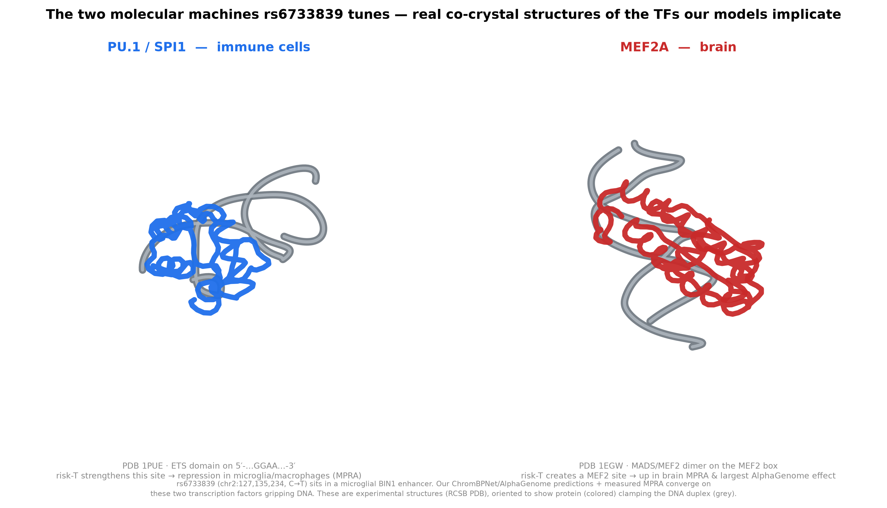

# 3D visualization — the molecular machines rs6733839 tunes

*What are we actually looking at? Every model in this project (ChromBPNet,
AlphaGenome) and the measured MPRA converge on the same physical event: the
Alzheimer's risk variant rs6733839 changes how two transcription factors grip
DNA. This section renders those two proteins — as real experimental structures —
in the act of binding.*

## Why these two structures

rs6733839 (chr2:127,135,234, C→T) sits in a microglia-specific enhancer ~25 kb
upstream of BIN1. Our analysis says the risk **T** allele retunes two motifs:

- **PU.1 / SPI1** (an ETS-family factor) — the master immune/microglial TF. In
  macrophages and microglia-like cells, measured MPRA shows the T allele acts
  *through SPI1* to **repress** transcription.
- **MEF2** (MEF2A here) — in brain, the T allele **creates/strengthens** a MEF2
  site; this is the single largest effect AlphaGenome predicted (MEF2A, quantile
  0.99), and brain MPRA constructs show upregulation.

So the honest, mechanistic picture is *two TFs, two cell contexts, opposite
directions* — and here they are as atoms.

## The interactive artifacts

Both open in the interactive 3D viewer (rotate/zoom):

- **`results/structures/PU1_SPI1_DNA.pdb`** — PU.1/SPI1 ETS domain bound to DNA
  (from **PDB 1PUE**, Kodandapani et al. 1996). The crystal DNA carries the ETS
  core **5′-…GGAA…-3′** — the exact PU.1 recognition site.
- **`results/structures/MEF2A_DNA.pdb`** — the MEF2A MADS/MEF2 domain **dimer**
  bound to DNA (from **PDB 1EGW**, Santelli & Richmond 2000). The DNA carries the
  A/T-rich **MEF2 box** these factors read.

Waters and ions were stripped for clarity; each file keeps one protein unit (PU.1
monomer / MEF2A dimer) and its DNA duplex.

## Honest caveats (important)

- **These are not structures OF rs6733839.** They are canonical experimental
  structures of the *transcription-factor families* our models implicate, bound to
  their *consensus* DNA sites — used to make the mechanism tangible. We did not
  model the variant into the DNA or run structural docking of the enhancer.
- The DNA in each crystal is the TF's optimal binding site, not the BIN1 enhancer
  sequence. A future step could thread the actual rs6733839 ref/alt sequence onto
  the DNA and compare predicted contacts — that would be a real structural
  prediction, not an illustration.
- Direction of effect (repression vs activation) is a functional readout from
  MPRA, not something visible in these static structures.

## Provenance
- PDB 1PUE — "PU.1 ETS domain–DNA complex" (RCSB, https://www.rcsb.org/structure/1PUE)
- PDB 1EGW — "Crystal structure of MEF2A core bound to DNA" (RCSB, https://www.rcsb.org/structure/1EGW)
- Fetched from RCSB; rendered with gemmi + matplotlib.
